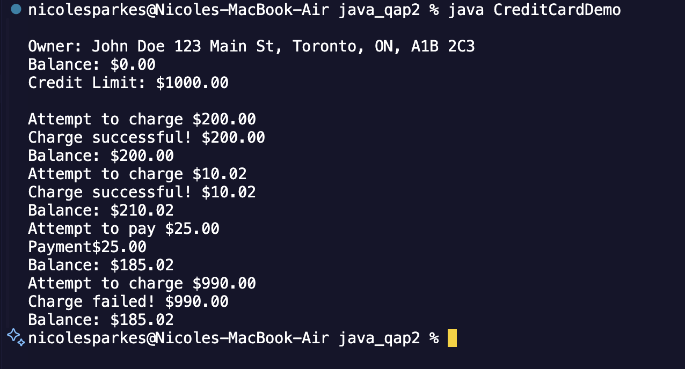
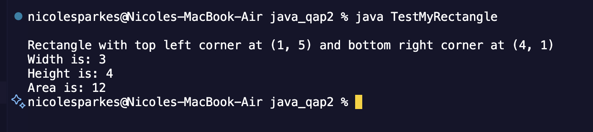
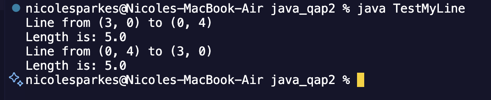

QAP 2 Java - Advanced Programming

Description

This project is part of QAP 2 for Java - Advanced Programming. The goal is to demonstrate object-oriented programming (OOP) concepts such as classes, constructors, encapsulation, and methods. It includes implementations of Money, CreditCard, Person, Address, MyPoint, and MyRectangle classes, along with a test program to validate functionality.

How to Run the Code

Follow these steps to compile and run the program:

1️⃣ Navigate to the Project Folder
Open the terminal and move to the project directory:

cd path/to/java_qap2

2️⃣ Compile All Java Files

javac *.java

3️⃣ Run the Main Program

For CreditCardDemo:
java CreditCardDemo

For TestMyRectangle:
java TestMyRectangle

Screenshots

Here are screenshots of the program running successfully:

Reflection

Time Spent:
⏳ Estimated: 3 hours

Online Resources Used:
YouTube Tutorials

Help & Collaboration:
Used ChatGPT for error fixing and explanations

Difficulty Level:
⭐⭐ 2 - Easy

💡 What I Learned:

How to properly structure Java classes
Using constructors and method overloading
Handling GitHub repositories and version control
Debugging compilation errors and logical issues